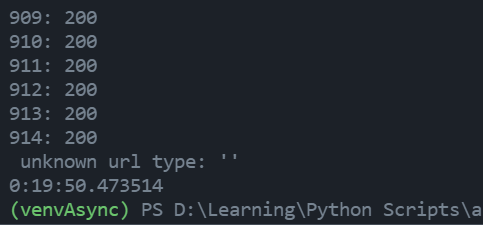
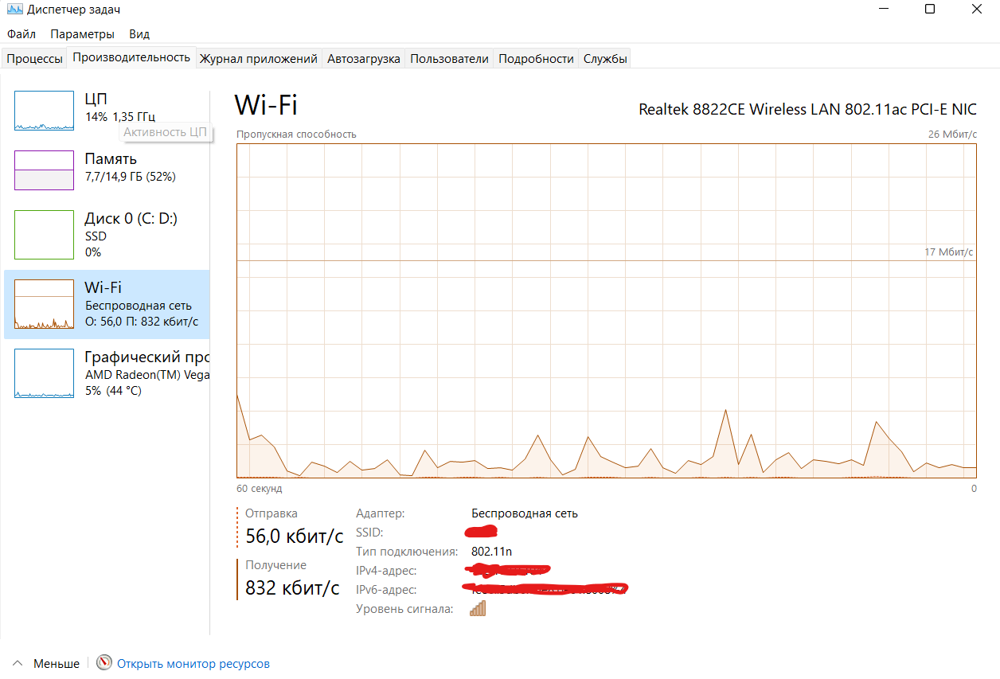
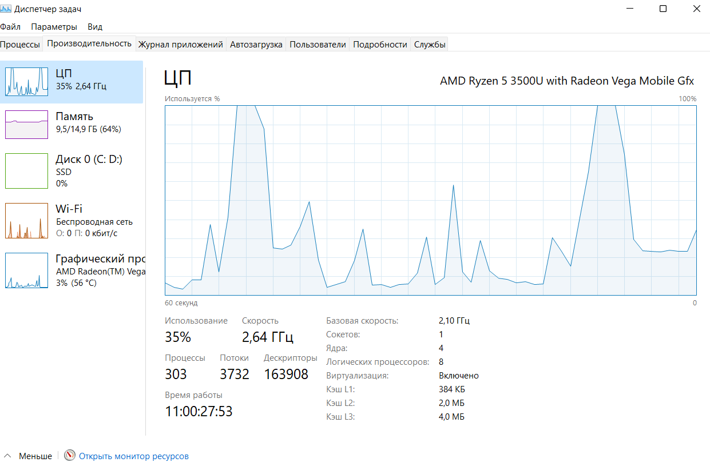
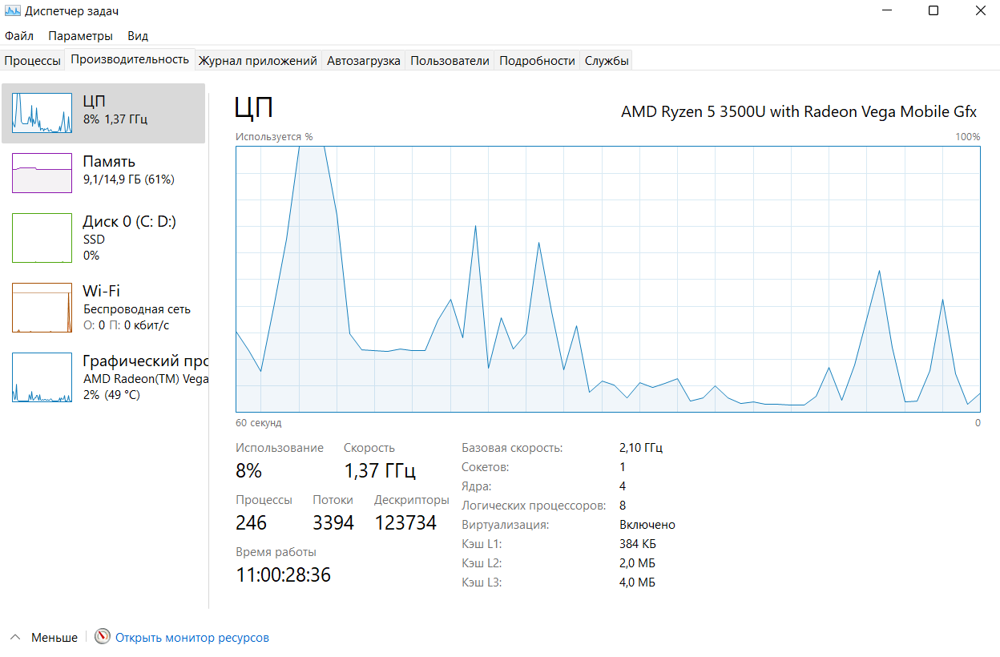

# urfu_python_async

## ThreadPoolExecutor

> Синхронная проверка ссылок на валидность заняла по времени почти 20 минут.

> При 5, 10 воркерах процессор и сеть нагружаются, но большой разницы не ощущается.

> При 100 воркерах заметно увеличивается нагрузка(как на сеть, так и на процессор). Разница с нагрузкой при 5-10 воркерах варьируется от 3 до 5 раз.
>> Вывод: Очевидно, что асинхронная обработка ссылок в контексте данной задачи - рациональное решение. Несмотря на нагрузку системы, время выполнения задачи заметно сокращается.

## ProcessPoolExecutor

> При решении CPU-bound не используется сеть, поэтому на нее нет никакой нагрузки. На скриншоте видна нагрузка ПК при 61 воркере(это максимум воркеров, который возможен на моей системе), видна нестабильная работа ЦП.

> При простое система использует для своих нужд ~240 процессов.
>> Как можно видеть из скриншота выше, количество процессов увеличивается равносильно увеличению количества воркеров в скрипте(что является логичным явлением).

> Из двух скриншотов выше можно сделать вывод, что увеличение количества воркеров для задачи типа CPU-bound не дает весомого прироста производительности. Несмотря на увеличение количества потоков и процессов, использование ЦП становится нестабильным.
>> Кроме того, среднее время генерации монеты изменяется незначительно или не изменяется вовсе. 